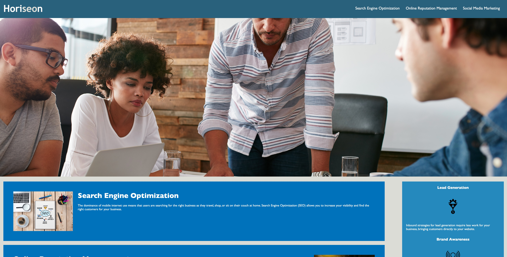

# Project Name
> Here goes your awesome project description!

## Table of contents
* [General info](#general-info)
* [Screenshots](#screenshots)
* [Technologies](#technologies)
* [Setup](#setup)
* [Features](#features)
* [Status](#status)
* [Contact](#contact)

## General info
This is our first project due for grading in our TES Coding Bootcamp Program. It's exciting to get right into it and looking forward to seeing how I did!

## Screenshot

## Technologies
* HTML
* CSS

## Setup
Clone files into your own root directory, file extensions are relative and will operate normally.

## Code Examples
Show examples of usage:

HTML:

 <!--"search engine optimization" section -->
        <section id="search-engine-optimization" class="search-engine-optimization">
            
            <h2>Search Engine Optimization</h2>
            

                The dominance of mobile internet use means that users are searching for the right business as they travel, shop, or sit on their couch at home. Search Engine Optimization (SEO) allows you to increase your visibility and find the right customers for your business.
            

        </section>

CSS:

/* Search Engine Optimization Style Start */
.search-engine-optimization {
    margin-bottom: 20px;
    padding: 50px;
    height: 300px;
    font-family: 'Gill Sans', 'Gill Sans MT', Calibri, 'Trebuchet MS', sans-serif;
    background-color: #0072bb;
    color: #ffffff;
}

.search-engine-optimization img {
    max-height: 200px;
}

.search-engine-optimization h2 {
    margin-bottom: 20px;
    font-size: 36px;
}
/* Search Engine Optimization Style End */

## Features
List of features
* 
* Awesome feature 2
* Awesome feature 3

To-do list:
* Secondary Pages to be Added
* Secondary CSS to be Added

## Status
Project is: completed. Assignment ready for submission.

## Contact
Created by Allen Lovatt - allenlovatt@gmail.com